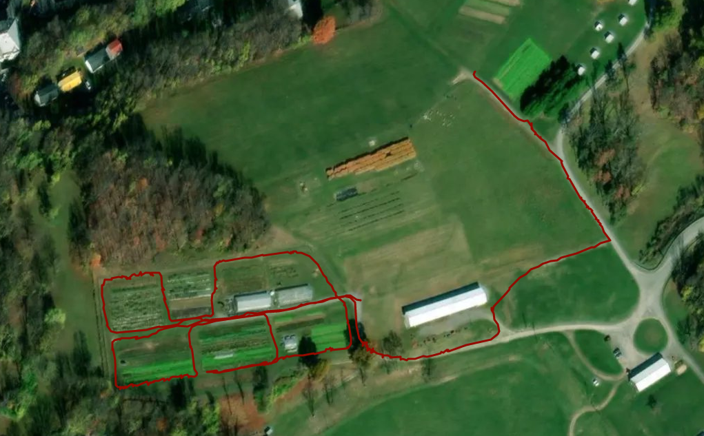

# Bramblebee_Workspace
  **WIP**
  
  Everything needed to get setup and running with the current Bramblebee robot.
  
  Tested on Melodic
  
  Noetic WIP
  
  
  
  
## Required Hardware

 ZED 2i
 
 Velodyne HDL-32E (Required for direct compatability, all Velodyne lidars are compatable with small edits)
 
 Intel Realsense D435
 
 Clearpath Robotics Husky
 
 Novatel GPS receiver and OEM6/7 IMU
 
## Dependencies
  Novatel GPS Driver: https://github.com/swri-robotics/novatel_gps_driver
  
  Realsense Driver: https://github.com/IntelRealSense/realsense-ros
  
  Velodyne Driver: https://github.com/ros-drivers/velodyne
  
  Zed SDK/wrapper: https://github.com/stereolabs/zed-ros-wrapper
  
  GPS Browser Visualizer: https://github.com/ziliHarvey/GPS-Browser-Visualizer

## Installation
  1. Make sure that the required hardware is setup properly
  2. Clone the following workspaces into your src folder and run catkin_make (make sure to install the proper dependencies when required):
  ```
  cd ~/${YOUR_CATKIN_WS}/src
  sudo apt install ros-melodic-husky-base
  git clone https://github.com/adsarver/smartag_datacollection
  rosdep install --from-paths src --ignore-src -r -y
  catkin_make
  ```
## How to run
  1. Navigate to the workspace src folder and run the launch.sh:
  ```
  cd ~/${YOUR_CATKIN_WS}/src
  sh launch.sh
  ```
  
## Optional
   1. CMU Exploration: Efficient autonomous navigation and path planning
   ```
   https://www.cmu-exploration.com/development-environment
   ```
   2. FAST_LIO: Fast mapping using lidar and imu data (post and live processing)
   ```
   https://github.com/hku-mars/FAST_LIO
   ```
  
